# 🚀 StockFlow AI

An AI-powered Inventory Management System built using **React**, **Vite**, **Supabase**, **Groq AI**, and **Chart.js**.

StockFlow AI helps businesses manage products, monitor inventory, visualize analytics, and get AI-powered inventory insights through a modern and responsive dashboard.

---

# ✨ Features

- 🔐 User Authentication (Login & Register)
- 📦 Product Management (Add, Edit, Delete)
- 📂 Category Management
- 📊 Analytics Dashboard
- 🤖 AI Inventory Assistant (Groq AI)
- 👁️ AI Vision (OCR using Tesseract.js)
- 📈 Inventory Analytics
- 🔍 Product Search
- ⚠️ Low Stock Monitoring
- 💰 Inventory Value Calculation
- 👤 User Profile
- ⚙️ Settings
- 📩 Contact Page
- 🔔 Notifications
- 🚪 Secure Logout
- 📱 Fully Responsive UI

---

# 🛠 Tech Stack

### Frontend

- React.js
- Vite
- React Router DOM
- CSS3

### Database

- Supabase

### Artificial Intelligence

- Groq AI

### Charts

- Chart.js
- React ChartJS 2

### OCR

- Tesseract.js

---

# 📂 Folder Structure

```text
StockFlow-AI
│
├── README.md
│
├── api
│   ├── package.json
│   ├── server.js
│   └── resend
│       └── emails.js
│
└── frontend
    │
    ├── screenshots
    │   ├── landing1.png
    │   ├── landing2.png
    │   ├── login.png
    │   ├── register.png
    │   ├── dashboard.png
    │   ├── products.png
    │   ├── add-product.png
    │   ├── analytics.png
    │   ├── ai-assistant.png
    │   ├── profile.png
    │   ├── settings.png
    │   └── contact.png
    │
    ├── public
    │   ├── favicon.svg
    │   ├── icons.svg
    │   └── robot.txt
    │
    ├── src
    │   ├── assets
    │   │   ├── icons
    │   │   ├── images
    │   │   └── logo
    │   │
    │   ├── components
    │   │   ├── ai
    │   │   ├── analytics
    │   │   ├── dashboard
    │   │   ├── product
    │   │   ├── AISection.jsx
    │   │   ├── BarChart.jsx
    │   │   ├── ConfirmDialog.jsx
    │   │   ├── DashboardPreview.jsx
    │   │   ├── Features.jsx
    │   │   ├── Footer.jsx
    │   │   ├── Loader.jsx
    │   │   ├── Modal.jsx
    │   │   ├── Navbar.jsx
    │   │   ├── ProtectedRoute.jsx
    │   │   ├── SearchBar.jsx
    │   │   ├── Sidebar.jsx
    │   │   ├── TopBar.jsx
    │   │   └── TrustedCompanies.jsx
    │   │
    │   ├── context
    │   │   ├── AuthContext.jsx
    │   │   ├── ProductContext.jsx
    │   │   └── ThemeContext.jsx
    │   │
    │   ├── pages
    │   │   ├── Landing.jsx
    │   │   ├── Login.jsx
    │   │   ├── Register.jsx
    │   │   ├── Dashboard.jsx
    │   │   ├── Products.jsx
    │   │   ├── AddProduct.jsx
    │   │   ├── EditProduct.jsx
    │   │   ├── Categories.jsx
    │   │   ├── Analytics.jsx
    │   │   ├── AIAssistant.jsx
    │   │   ├── Vision.jsx
    │   │   ├── Profile.jsx
    │   │   ├── Settings.jsx
    │   │   ├── Contact.jsx
    │   │   └── NotFound.jsx
    │   │
    │   ├── routes
    │   │   └── AppRoutes.jsx
    │   │
    │   ├── services
    │   │   ├── analyticsService.js
    │   │   ├── authService.js
    │   │   ├── groq.js
    │   │   ├── productService.js
    │   │   ├── resend.js
    │   │   ├── supabase.js
    │   │   └── visionService.js
    │   │
    │   ├── utils
    │   │   ├── constants.js
    │   │   ├── formatDate.js
    │   │   ├── helpers.js
    │   │   └── validators.js
    │   │
    │   ├── App.jsx
    │   ├── App.css
    │   ├── index.css
    │   └── main.jsx
    │
    ├── .gitignore
    ├── .env
    ├── eslint.config.js
    ├── index.html
    ├── package.json
    ├── package-lock.json
    └── vite.config.js

```

---

# 📸 Screenshots

## 🏠 Landing Page

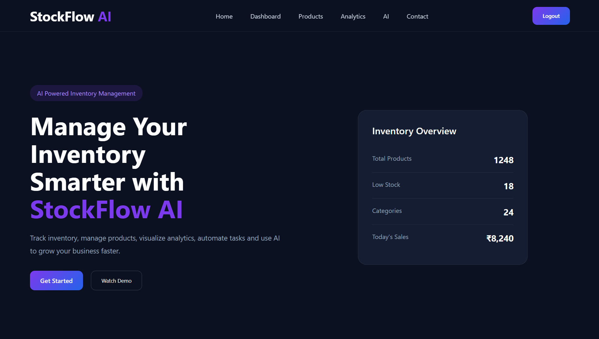

---

## ✨ Landing Features

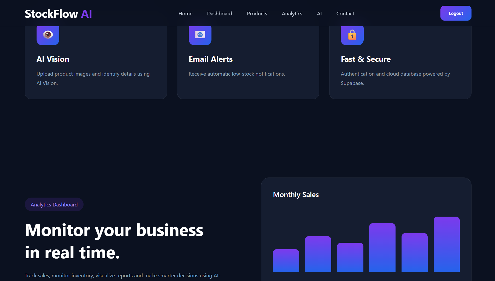

---

## 🔐 Login

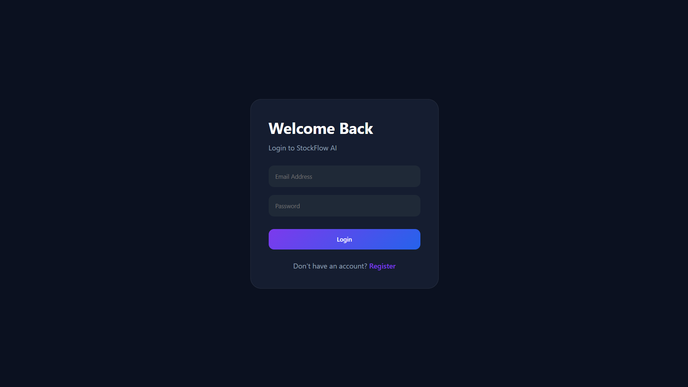

---

## 📝 Register

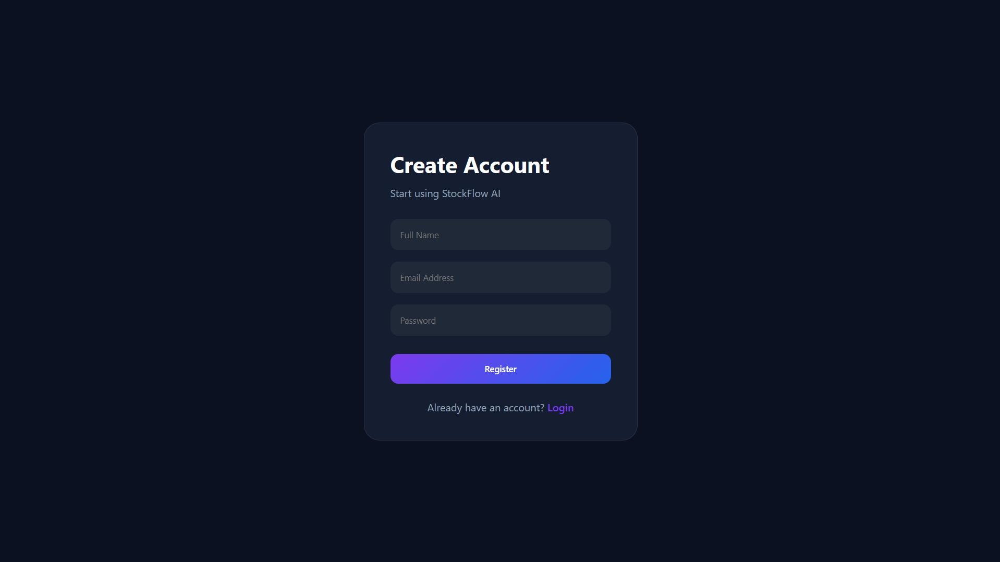

---

## 📊 Dashboard

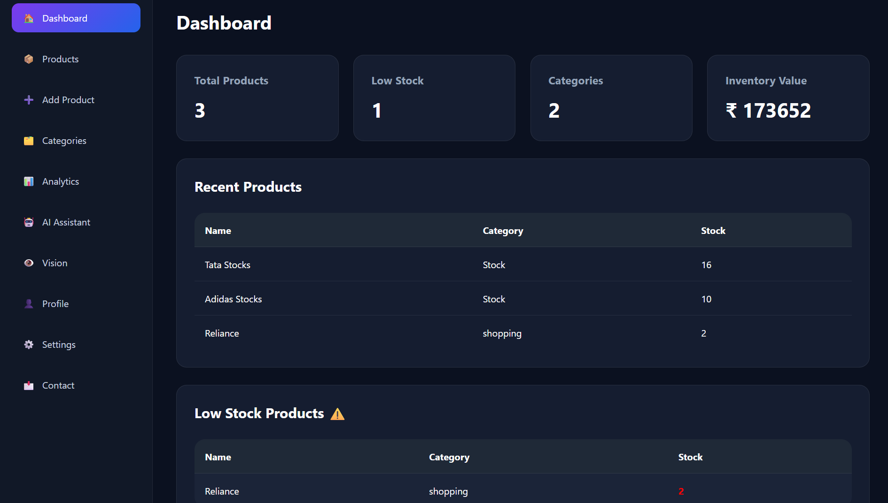

---

## 📦 Products

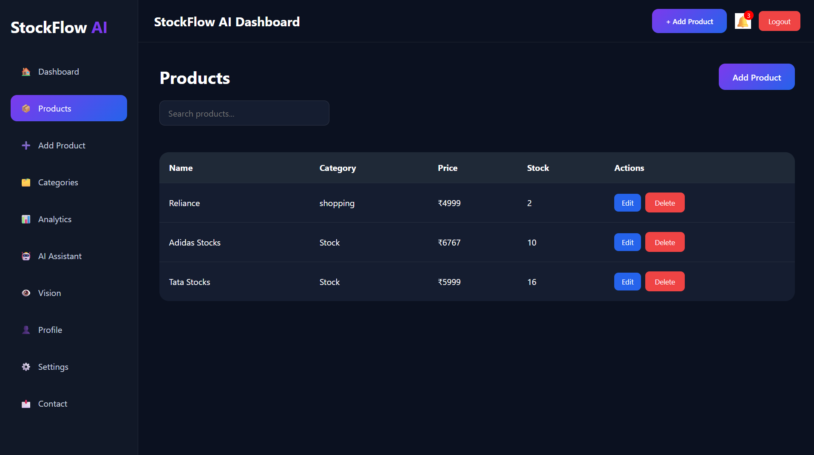

---

## ➕ Add Product

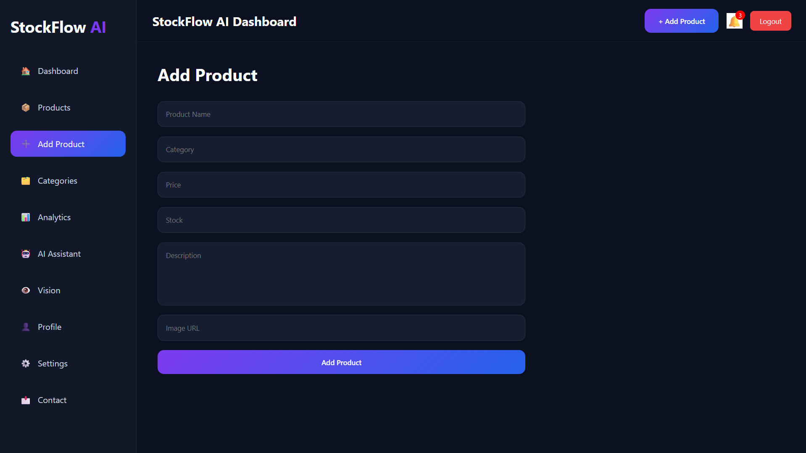

---

## 📈 Analytics

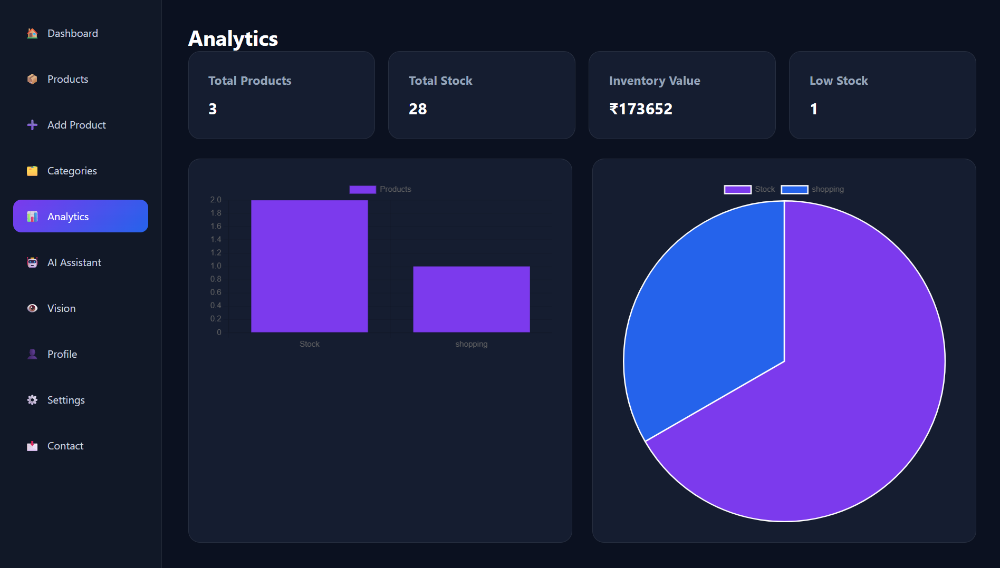

---

## 🤖 AI Assistant

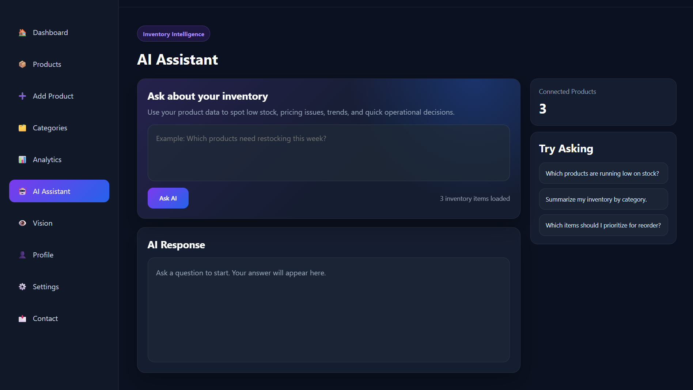

---

## 👤 Profile

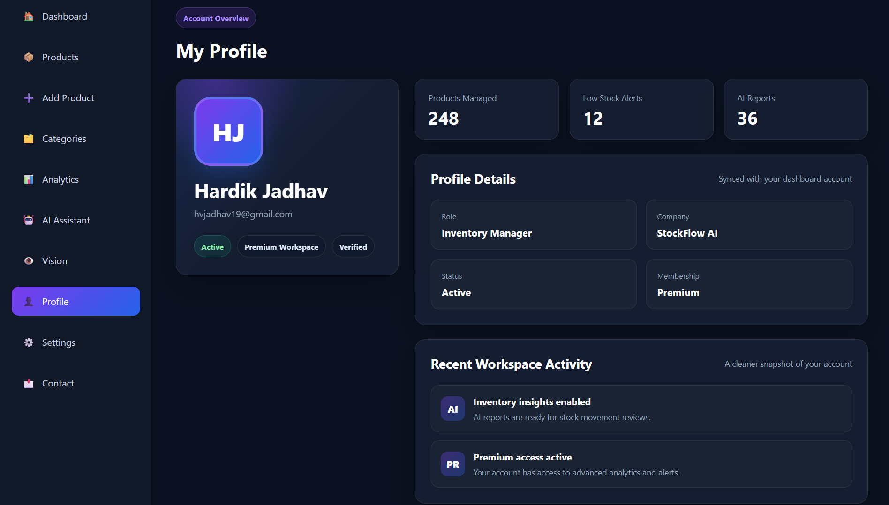

---

## ⚙️ Settings

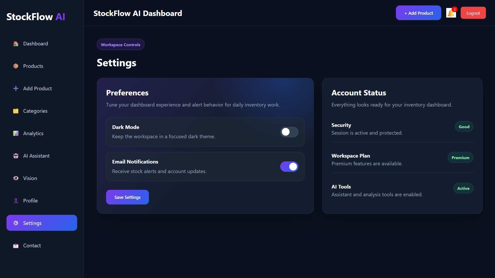

---

## 📩 Contact

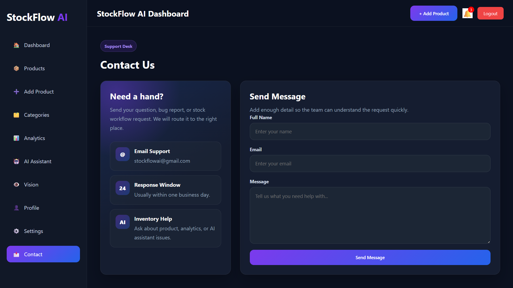

---

# 🚀 Installation

Clone the repository

```bash
git clone https://github.com/Hardikkkkkkk19/StockFlow-AI.git
```

Go to project

```bash
cd StockFlow-AI/frontend
```

Install dependencies

```bash
npm install
```

Start the development server

```bash
npm run dev
```

---

# 🔑 Environment Variables

Create a `.env` file inside the **frontend** folder.

```env
VITE_SUPABASE_URL=YOUR_SUPABASE_URL

VITE_SUPABASE_ANON_KEY=YOUR_SUPABASE_ANON_KEY

VITE_GROQ_API_KEY=YOUR_GROQ_API_KEY
```

---

# 🎯 Future Improvements

- 📧 Email Notifications
- 📦 Barcode Scanner
- 📈 Sales Forecast
- 🌙 Dark Mode
- 📤 Export Reports
- 👥 Multi-user Support
- 📱 Mobile Application

---

# 👨‍💻 Developer

**Hardik Vinod Jadhav**

Diploma in Computer Engineering

Full Stack Developer | UI/UX Enthusiast

GitHub

https://github.com/Hardikkkkkkk19

---

# ⭐ Support

If you like this project, don't forget to **Star ⭐ the repository**.

---

# 📜 License

This project was developed for educational and learning purposes.
